# eBank CQRS ES

A Spring Boot microservice implementing the **Command Query Responsibility Segregation (CQRS)** pattern with **Event Sourcing (ES)** for managing bank accounts.

## Overview

This project demonstrates a modern event-driven architecture using:
- **CQRS**: Separates read (Query) and write (Command) operations
- **Event Sourcing**: Stores all changes as immutable events
- **Axon Framework**: Event-driven framework for CQRS/ES implementation
- **Spring Boot 4.0.1**: Enterprise-grade application framework

## Technology Stack

| Component | Version |
|-----------|---------|
| Java | 21 |
| Spring Boot | 4.0.1 |
| Axon Framework | 4.10.3 |
| Maven | 3.9.12 |
| H2 Database | Latest |
| PostgreSQL | Latest |
| Lombok | 1.18.36 |
| SpringDoc OpenAPI | 2.8.4 |

## Project Structure

```
ebank-cqrs-es/
├── src/
│   ├── main/
│   │   ├── java/com/azmi/ebankcqrses/
│   │   │   ├── EbankCqrsEsApplication.java
│   │   │   ├── commands/
│   │   │   │   ├── commands/          # Command definitions
│   │   │   │   ├── controllers/       # Command API endpoints
│   │   │   │   └── dtos/              # Data Transfer Objects
│   │   │   └── query/                 # Query side
│   │   └── resources/
│   │       └── application.properties
│   └── test/
│       └── java/com/azmi/ebankcqrses/
├── pom.xml
└── Readme.md
```
### Command Endpoints

#### Create New Account

```http
POST /commands/add
Content-Type: application/json

{
  "initialBallance": 1000.0,
  "cuurency": "USD"
}
```

## Architecture

### Command Side
- Handles write operations and business logic
- **Controller**: [`AccountCommandController`](src/main/java/com/azmi/ebankcqrses/commands/controllers/AccountCommandController.java)
- **Commands**: [`AddAcoountCommand`](src/main/java/com/azmi/ebankcqrses/commands/commands/AddAcoountCommand.java)
- **DTOs**: [`AddNewAccountRequestDTO`](src/main/java/com/azmi/ebankcqrses/commands/dtos/AddNewAccountRequestDTO.java)

### Query Side
- Handles read operations and projections
- Located in `query/` package

### Event Sourcing
- All state changes are captured as immutable events
- Events are stored and replayed to reconstruct state

## Package Command
## Controller

## DTO

## Add Account Command

## Swagger UI
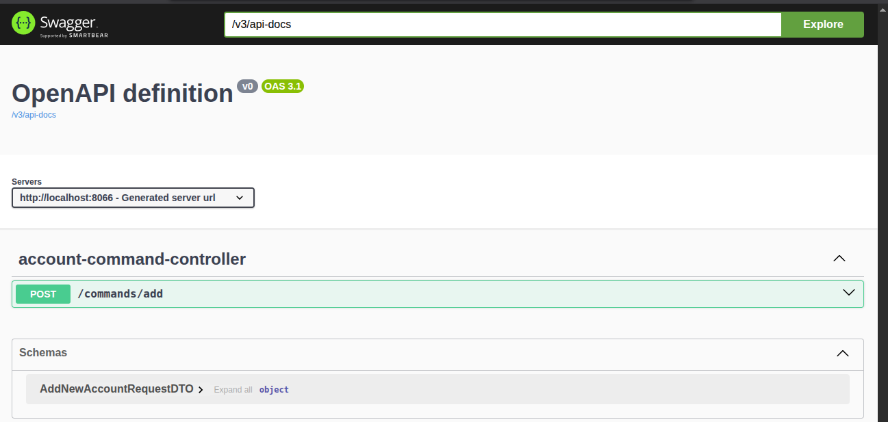
## Affichage de H2 database
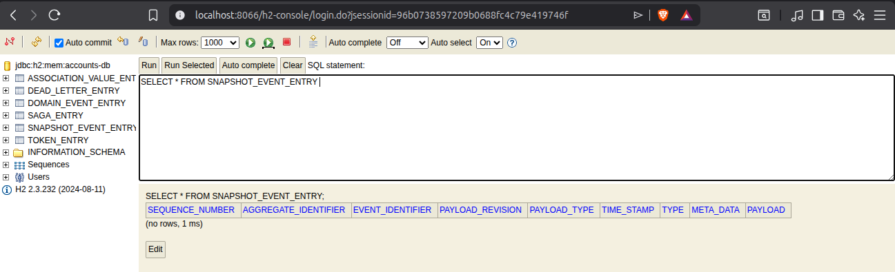

## Postgress DB
### Configu
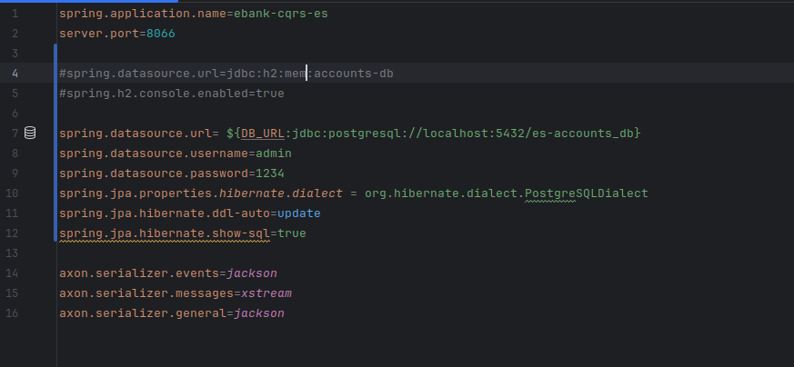

### Apercu
Apres injecter un exemplaire en utisant endpoit add dans swagger


## Affichage des evenments d'un compte
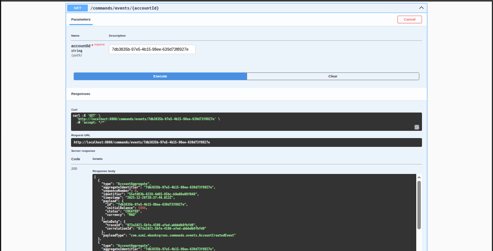

## Affichage Credit
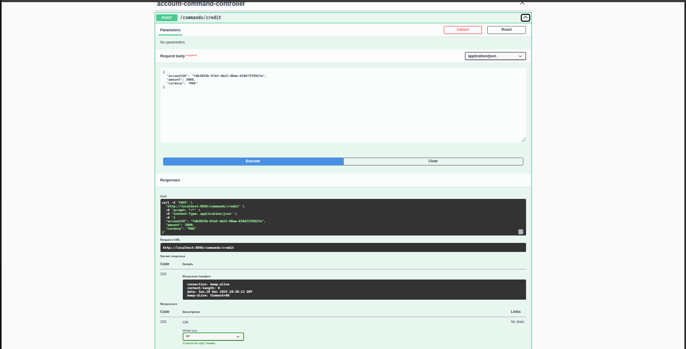

## Affichage Debit
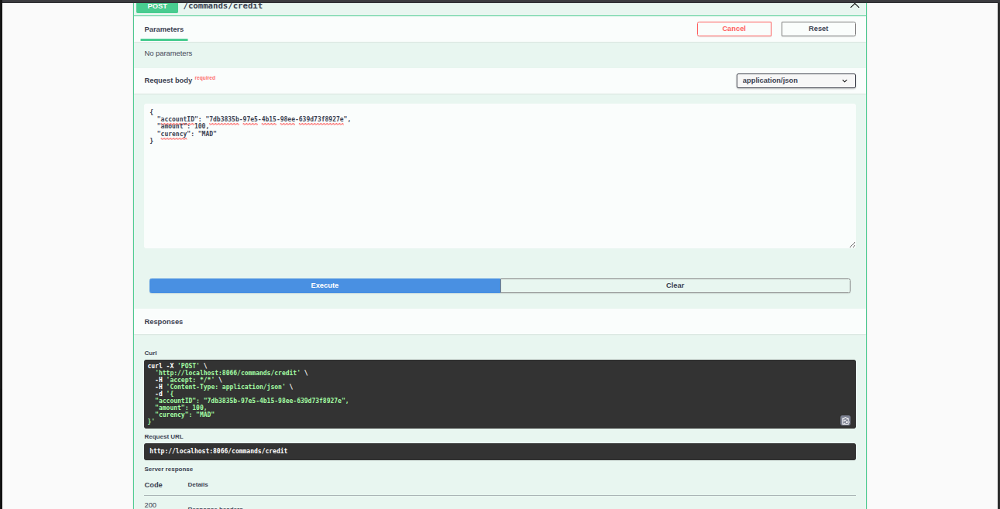

## Package Query
## Entities
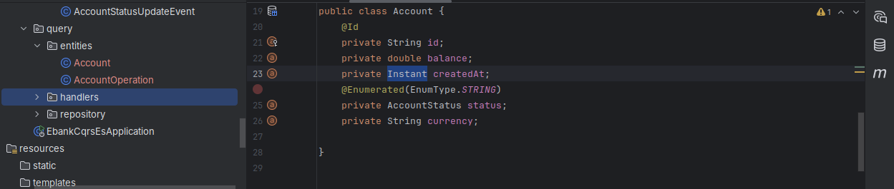

## Repository
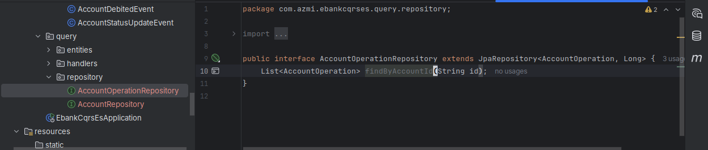
## Event Handler
### AccountEventHandler
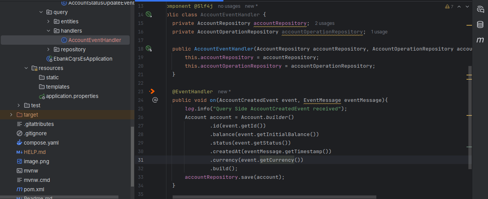
### Run app
Here when runing the handler will handel the previous events and store data in our DB
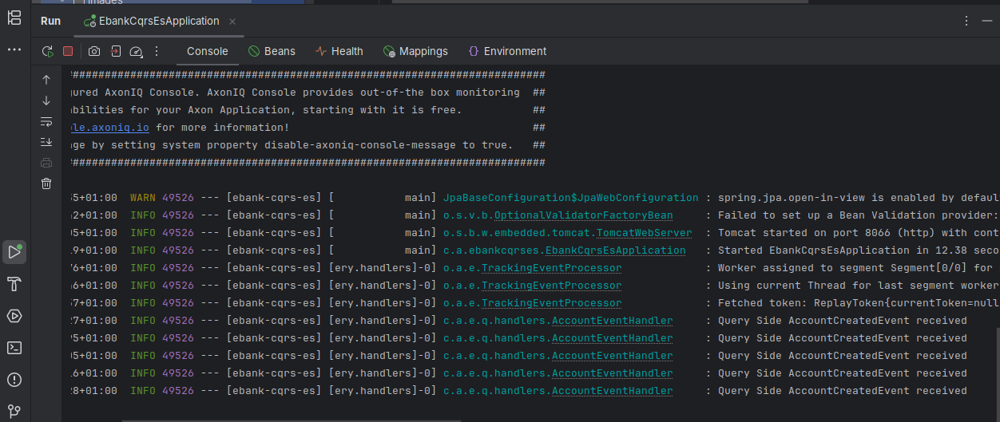
### Postgress table Account verification
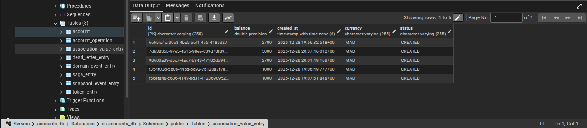
### Postgress table AccountOperation verification
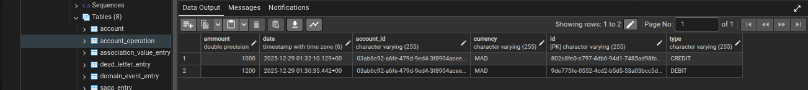
